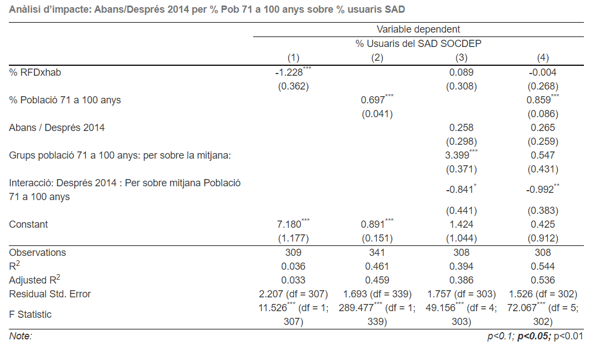
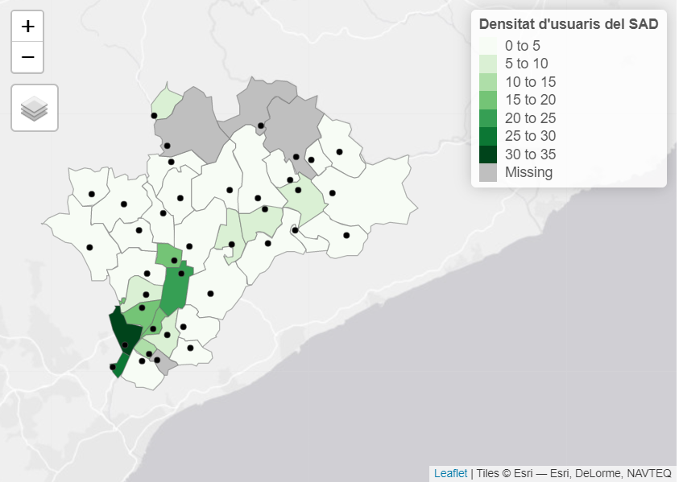
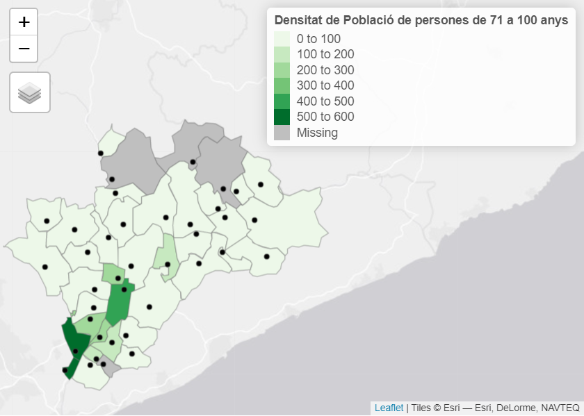
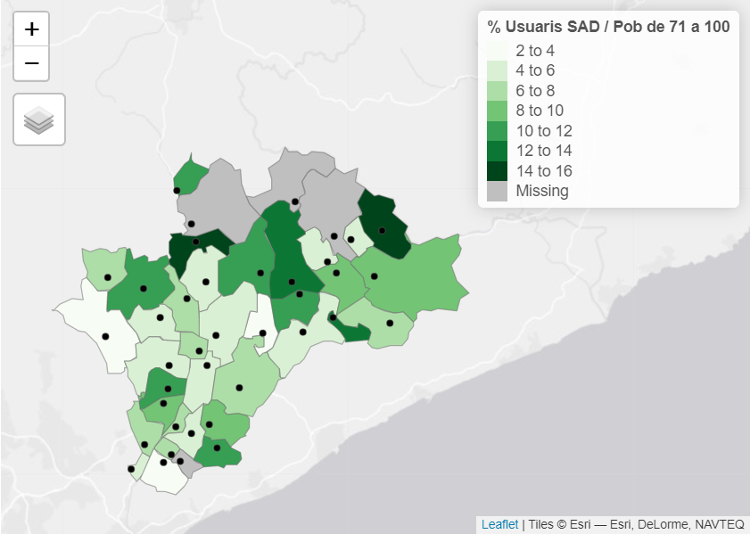
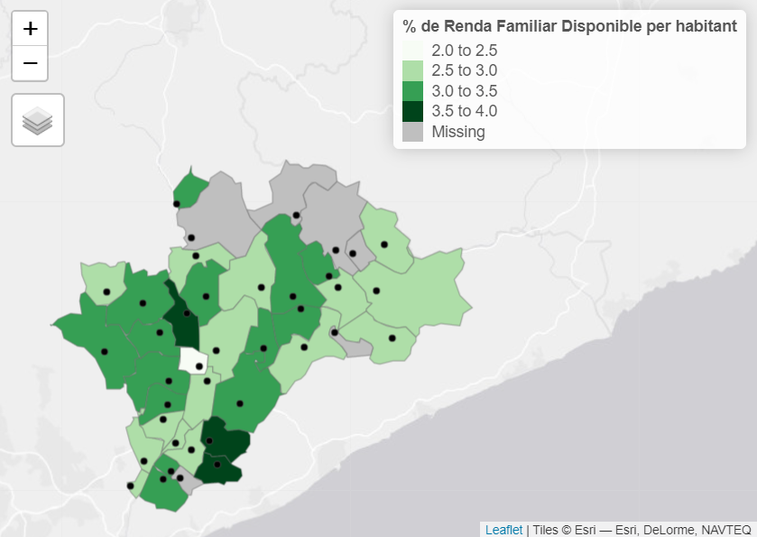

```{r, setup, global-options, include=FALSE}
# knitr::opts_knit$set(root.dir = "C:/Users/vallsga/Desktop/Albert Valls/Projecte analisi SAD")
knitr::opts_chunk$set(echo=FALSE, warning=FALSE, message=FALSE)

library(tidyverse)
library(readxl)
# library(plyr)
library(dplyr)
library(lubridate)
library(stargazer)
library(ggeffects)
library(modelsummary)
library(summarytools)
library(foreign)
library(stringr)
library(ggplot2)
library(XML)
library(reshape2)
library(forecast) # install.packages("forecast")
library(knitr)
library(GGally)
library(corrplot)
library(kableExtra)
# https://stackoverflow.com/questions/32034815/format-ttest-output-by-r-for-tex
library(pander)

library(broom)
library(purrr)
library(ggrepel)

options(scipen=999)


# ABBS
SAD_TOT_V <- read_csv("Data/SAD_AMB_VARIABLES/SAD_TOT_V.csv")
SAD_TOT_V  <- SAD_TOT_V %>% select(-starts_with("..."))

SAD_TOT_V <- SAD_TOT_V[!(SAD_TOT_V$`Núm. Expedient` =="30/055/2020"),]
SAD_TOT_V$Tipus <- recode(SAD_TOT_V$Tipus, "social" = "Social")

# ABBS
SAD_T_SOCIAL_V <- read_csv("Data/SAD_AMB_VARIABLES/SAD_T_SOCIAL_V.csv")
SAD_T_SOCIAL_V <- SAD_T_SOCIAL_V  %>% select(-starts_with("..."))

SAD_T_SOCIAL_V$Tipus <-  recode(SAD_T_SOCIAL_V$Tipus, "social" = "Social")

# ABBS
SAD_T_FamiliarSocial_V <- read_csv("Data/SAD_AMB_VARIABLES/SAD_T_FamiliarSocial_V.csv")
SAD_T_FamiliarSocial_V <- SAD_T_FamiliarSocial_V %>% select(-starts_with("..."))

# ABBS
SAD_T_FamiliarDependencia_V <- read_csv("Data/SAD_AMB_VARIABLES/SAD_T_FamiliarDependencia_V.csv")
SAD_T_FamiliarDependencia_V <- SAD_T_FamiliarDependencia_V %>% select(-starts_with("..."))

# ABBS
SAD_T_DepNoJust_V <- read_csv("Data/SAD_AMB_VARIABLES/SAD_T_DepNoJust_V.csv")
SAD_T_DepNoJust_V <- SAD_T_DepNoJust_V %>% select(-starts_with("..."))

# ABBS
SAD_T_Dependencia_V <- read_csv("Data/SAD_AMB_VARIABLES/SAD_T_Dependencia_V.csv")
SAD_T_Dependencia_V<- SAD_T_Dependencia_V %>% select(-starts_with("..."))

# SAD VALLES ORIENTAL

SADSOCDEPVO2011_2020 <- read_csv("Data/SAD_AMB_VARIABLES/SADSOCDEPVO2011_2020.csv") %>% select(-starts_with("..."))

# Pens_BCN

Pens_BCN <- read_excel("Data/SAD_AMB_VARIABLES/Estadisticas_Pens_BCN.XLS", sheet = 2)

Pens_BCN$Any <- as.numeric(Pens_BCN$Any)

SADSOCDEPVO2011_2020 <- left_join(SADSOCDEPVO2011_2020, Pens_BCN, by = "Any")

SADSOCDEPVO2011_2020 <- SADSOCDEPVO2011_2020 %>% 
  mutate(Sou_pens_Jub = `Importe total nómina Jubilación`/ `Número pensiones Jubliación` ) %>%
  mutate(Sou_pens_viu = `Importe total nómina Viudedad` / `Número pensiones Viudedad`) %>% 
  mutate(Global_sou_pens = `Importe total nómina`  / `Número pensiones`) %>% 
  mutate(Densit_pens = `Nombre de pensionistes` / `Superficie (km2)`)


```

L’edat no perdona i fins i tot, quan som joves el cos ens traeix i deixa de fer cas a la nostra voluntat. Podem perdre autonomia física, mental i sensorial que ens impedeix fer actes simples i quotidians, com cuinar, anar a comprar, caminar, menjar, etc. Quan això passa es diu que esdevenim dependents. Fer front a aquesta realitat no sempre és fàcil en el context econòmic, polític i social que vivim i que és ple de grans reptes als quals cal distribuir una atenció pública limitada.

Tradicionalment, aquesta situació s’ha resolt a través de les cures de la família envers aquells membres que han esdevingut dependents. Tanmateix, les famílies tenen configuracions diverses que obren la possibilitat al fet que molts membres que puguin esdevenir dependents, no tinguin l’alternativa de tenir una atenció perquè els potencials cuidadors són parents llunyans, treballadors o tenen altres ocupacions prioritàries, entre d’altres.

Des de l’aparició de l’estat i les administracions públiques, s’han cercat diverses solucions. Per exemple, s’ha procurat que altres membres de la societat tinguin cura d’aquelles persones que per diversos motius, afronten una situació de dependència. Una segona opció ha consistit en donar una compensació als familiars d’una persona dependent que hagin esdevingut cuidadors del seu familiar. Aquestes solucions, que poden derivar en serveis o ajuts públics, generen riscos i costos econòmics que col·lectivament cal afrontar.

Actualment, podríem dir que la dependència no és un tema que aparegui sovint als mitjans de comunicació o a les xarxes socials, però entre els anys setanta i el 2006, les cures de llarga durada i l’atenció a la dependència sí que van tenir una presència destacada a l’agenda pública. De fet, és l’època en la qual es configura el sistema de cures de llarga durada (CLD) que tenim des de 2006 i del qual, el Servei d’Atenció a Domicili (SAD) en forma part.

En aquest article, he volgut estudiar preliminarment quines són les variables sociodemogràfiques que expliquen el canvi en el nombre d’usuaris del SAD i analitzar com varien els usuaris del SAD en funció d’aquelles variables que l’expliquen a la comarca del Vallès Oriental.

Per fer això, faig servir tècniques de recerca multivariants mentre ofereixo un conjunt de mapes de la comarca on es visualitzen les distribucions als municipis de les variables sociodemogràfiques estudiades. Abans d’oferir aquest anàlisi, faig una breu descripció de l’esmentat sistema de CLD implantat des del 2006 i del qual el SAD en forma part. També hi ha una menció a la legislació catalana posterior, perquè les dues lleis diferencien la gestió i el finançament del SAD. Fent tot això, espero retornar els afers de cures de llarga durada com el SAD al radar públic. Perquè com veurem, hi ha autors que afirmen que la universalització de serveis d’aquest tipus encara no s’ha assolit, tot i que ha millorat força.

L’anàlisi se centra en el servei del SAD pel fet que he estat jove en pràctiques al Consell Comarcal del Vallès Oriental (CCVOR) i la meva tasca ha estat analitzar les dades del SAD de la comarca. Els fitxers rebuts i treballats es corresponen amb les dades del SAD dels municipis de l’Àrea Bàsica de Serveis Socials del Vallès Oriental – Resta del Vallès Oriental (ABSSVOR – Resta del VOR). Per més informació sobre les ABSS, veure l’article 34 de la llei 12/2007.

Pel catedràtic Vicenç Navarro, el debat sobre la dependència anterior al 2006 es va correspondre en desenvolupar el quart pilar de l’estat del benestar a Espanya i complementar els altres tres: el dret a la sanitat, el dret a l’educació i el dret a la jubilació. Aquest catedràtic ha explicat que va assessorar a membres del PSOE sobre el desenvolupament d’aquest quart pilar. Quan el PSOE va tornar a assolir el govern, Vicenç Navarro fa èmfasi en el fet que el govern del president José Luís Rodríguez Zapatero es va centrar exclusivament en el desenvolupament dels serveis domiciliaris tot menystenint l’impuls de les escoles bressol. Mentrestant, l’equip econòmic del president aplicava polítiques d’austeritat (Navarro, 2020).

Segons Rodríguez Cabrero i Marbán Gallego a l’estat Espanyol, el debat sobre la dependència es va caracteritzar per la interacció entre l’estat, el mercat, la família i la societat civil en mig de canvis de governs i canvis sociodemogràfics. Especialment, l’envelliment de la població, canvis en la funció de la família i la integració laboral de la dona. Durant el debat hi va haver una tensió latent entre els següents punts de gravetat; assolir un model de servei universal o assolir un model de caràcter assistencial per contenir la despesa del servei (Rodríguez Cabrero & Marbán Gallego, 2016).

La culminació del sistema de CLD el trobem amb l’aprovació de la llei 39/2006, de 14 de desembre, de Promoció de l’Autonomia Personal i Atenció a les Persones en Situació de Dependència (LAPAD) i el desenvolupament del Sistema Espanyol d’Autonomia i Dependència (SAAD). Posteriorment, a Catalunya es va aprovar la llei 12/2007 de serveis socials, que va introduir les ABSS i el professional de referència. En relació al SAD, les dues lleis han establert diferències de modalitats en l’aprovisionament, la gestió i finançament a Catalunya: SAD Social i SAD Dependència.

Segons Rodríguez Cabrero, la LAPAD és una combinació amb major o menor mesura dels següents elements (Rodríguez Cabrero, 2007):

- Universalisme creixent, però limitat.
- Extensió i intensificació de la responsabilitat familiar.
- Gestió descentralitzada.
- Suport en el sector privat: això ha comportat que empreses i el tercer sector proveeixin serveis públics.
- Importància de la persona afectada o usuari i el seu dret a escollir la prestació adequada a les seves necessitats.

Juntament amb Marbán Gallego també explica que l’actual sistema de resposta a la dependència, el risc es comparteix entre diversos agents institucionals i socials mentre es garanteix una cobertura universal de prestacions bàsiques topades; es gestiona de manera descentralitzada; i la provisió de serveis és mixta en un marc creixent de competència entre els sectors mercantils i el Tercer Sector (Rodríguez Cabrero & Marbán Gallego, 2016). Per tant, serveis com el SAD acostumen estar externalitzats.

Respecte a l’èxit o fracàs del sistema establert des de 2006, Aguilar-Hendirckson argumenta que no hi ha una resposta concreta sinó que depèn de certs paràmetres d’avaluació. Si es pren al peu de la lletra els objectius i el discurs de la llei (màxima universalització), és fàcil concloure que ha fracassat perquè no s’ha assolit. A més, encara hi ha moltes queixes sobre la qualitat del servei (Aguilar-Hendirckson, 2020).

En qualsevol cas, aquest autor considera que la reforma va ser parcialment exitosa. El govern central, sense tenir gaire en compte els ens autonòmics i locals, va regular i estructurar un sistema de serveis de cures i atencions socials que anteriorment eren gairebé residuals (Aguilar-Hendirckson, 2020).

Malgrat la posterior descentralització i fragmentació del sistema CLD a les autonomies i ens locals, es va contribuir a oferir serveis socials, com el Servei d’Atenció a Domicili (SAD), a una creixent part de la població (Aguilar-Hendirckson, 2020). Segons aquest autor, encara no hi ha plena universalització, tot i que la provisió i l’accés al servei ha millorat.

Per mesurar la universalització dels serveis de CLD, la qüestió fonamental per respondre és quina part de la població que és dependent té o no té accés als serveis de CLD i quina quantitat de població dependent en fa ús actualment.

Aquesta qüestió no la intento resoldre però n’ofereixo una aproximació des d’altres paràmetres. Mitjançant el llenguatge de programació en R, he transformat els fitxers proporcionats pel CCVOR. He contat quantes persones usuàries del SAD hi ha a cada municipi (casos) i quantes hores se’ls hi ha dedicat conjuntament de manera anual per un període de deu anys que compren des del 2011 a 2020.

He incorporat a l’anàlisi aquelles variables que després de lectures sobre la dependència i les CLD m’han semblat que poden tenir una estreta relació amb el SAD. Per això, he inclòs variables poblacionals, de salut o de pobresa. Així com també, el llindar de pobresa, l’esperança de vida, o els anys de vida saludables. Un cop incorporades, mitjançant una matriu de correlacions he determinat quines estan correlacionades amb les variables del SAD al Vallès Oriental i les he analitzat més profundament.

```{r}
Agregecosocsalpob.any.muni <- SADSOCDEPVO2011_2020 %>% select(Codi, Any, Homes, Dones,
                                                     Total_Usuaris_SOCDEP,
                                                     Total_Usuaris_SOCDEP_Home,
                                                     Total_Usuaris_SOCDEP_Dona,
                                                     Total_Hores_SOCDEP,
                                                     Total_POB_MUNI,
                                                     `RFDB milers d'euros`,
                                                     `RFDB per habitant. Milers d'euros`, 
                                                     `VO PIB  per habitant. Milers d'euros`,
                                                     `De 71 a 100`,
                                                     Densit.pob.De_71_a_100,
                                                     Densit_pens,
                                                     Esperanca_vida_H_I_D_BCN_PROV, 
                                                     `Places Centres de dia`, 
                                                     `Total places Residències`,
                                                     `Nombre de pensionistes`,
                                                     Anys_Dependencia, 
                                                     `Soport financer als ens locals`,
                                                     `Deute públic`,
                                                     `Pressupots Consell Comarcal Vallès Oriental (milions €)`,
                                                     Perc_Total_Pob_CAT_Sota_Llindar_pobresa,
                                                     `Índex de Gini (CAT)`,
                                                     `Índex de ràtio S80/S20 (CAT)`,
                                                     `Taxa de risc de pobresa o exclusió social (taxa AROPE)`,
                                                     `Població en risc de pobresa (després de transferències socials)`,
                                                     `Població que viu en llars amb intensitat de treball molt baixa (1)`,
                                                     `Població amb privació material severa`) %>%
  mutate(RFD_x_hab = `RFDB milers d'euros`/ Total_POB_MUNI)

Agregecosocsalpob.any.muni$`RFDB per habitant. Milers d'euros` <- str_pad(Agregecosocsalpob.any.muni$`RFDB per habitant. Milers d'euros`, width = 5, side = "right" , pad = "0")

Agregecosocsalpob.any.muni$`RFDB per habitant. Milers d'euros` <- as.numeric(Agregecosocsalpob.any.muni$`RFDB per habitant. Milers d'euros`)


Agregecosocsalpob.any.muni[is.na(Agregecosocsalpob.any.muni)] <- 0

Agregecosocsalpob.any.muni <- Agregecosocsalpob.any.muni %>% 
  #group_by(Codi) %>% 
  group_by(Any, Codi) %>% 
  summarise_all(funs(sum(., na.rm = TRUE))) %>% distinct()
  
# Agregecosocsalpob.any.muni <- left_join(Agregecosocsalpob.any.muni1, Agregecosocsalpob.any.muni, by = "Any")

#rm(Agregecosocsalpob.any.muni1)

Agregecosocsalpob.any.muni <- Agregecosocsalpob.any.muni %>% 
  mutate(Perc_Homes = (Homes / sum(Homes))*100) %>%  
  mutate(Perc_Dones = (Dones / sum(Dones))*100) %>% 
  mutate(Perc_Total_Usuaris_SOCDEP = (Total_Usuaris_SOCDEP / sum(Total_Usuaris_SOCDEP))*100) %>%
  mutate(Perc_Total_Usuaris_SOCDEP_Home = (Total_Usuaris_SOCDEP_Home / sum(Total_Usuaris_SOCDEP_Home))*100) %>%
  mutate(Perc_Total_Usuaris_SOCDEP_Dona = (Total_Usuaris_SOCDEP_Dona / sum(Total_Usuaris_SOCDEP_Dona))*100) %>%
  mutate(Perc_Total_Hores_SOCDEP = (Total_Hores_SOCDEP / sum(Total_Hores_SOCDEP))*100) %>%  
  mutate(Perc_RFD_xhab = (RFD_x_hab / sum(RFD_x_hab))*100) %>% 
  mutate(Perc_VO_PIB_xhab = (`VO PIB  per habitant. Milers d'euros` / sum(`VO PIB  per habitant. Milers d'euros`))*100) %>%
  mutate(Perc_Pob_71a100 =  (`De 71 a 100` / sum(`De 71 a 100`))*100) %>% 
  mutate(Perc_Densit.pob.De_71_a_100 =  (Densit.pob.De_71_a_100 / sum(Densit.pob.De_71_a_100))*100) %>%
  mutate(Perc_Densit_pens =  (Densit_pens / sum(Densit_pens))*100) %>%
  mutate(Perc_Total_POB_MUNI =  (Total_POB_MUNI / sum(Total_POB_MUNI))*100) %>% 
  mutate(Perc_Esperanca_vida_H_I_D_BCN_PROV = (Esperanca_vida_H_I_D_BCN_PROV / sum(Esperanca_vida_H_I_D_BCN_PROV))*100) %>% 
  mutate(Perc_Places_Centres_de_dia = (`Places Centres de dia` / sum(`Places Centres de dia`))*100) %>% 
  mutate(Perc_Total_places_residencies = (`Total places Residències` / sum(`Total places Residències`))*100) %>%
  mutate(Perc_N_pensionistes = (`Nombre de pensionistes` / sum(`Nombre de pensionistes`))*100) %>% 
  mutate(Perc_Anys_Dependencia = (Anys_Dependencia / sum(Anys_Dependencia))*100) %>% 
  mutate(Perc_suport_financer_als_ens_locals = (`Soport financer als ens locals` / sum(`Soport financer als ens locals`))*100) %>% 
  mutate(Perc_Deute_public = (`Deute públic` / sum(`Deute públic`))*100) %>% 
  mutate(Perc_Pressupostos_CCVOR_ME = (`Pressupots Consell Comarcal Vallès Oriental (milions €)` / 
                                         sum(`Pressupots Consell Comarcal Vallès Oriental (milions €)`))*100) %>% 
  mutate(Perc_i_Gini_CAT = (`Índex de Gini (CAT)` / sum(`Índex de Gini (CAT)`))*100) %>% 
  mutate(Perc_ratio_S80_s20 = (`Índex de ràtio S80/S20 (CAT)` / sum(`Índex de ràtio S80/S20 (CAT)`))*100) %>% 
  mutate(Perc_T_Risc_pobresa_o_exclusio_soc_taxa_AROPE = (`Taxa de risc de pobresa o exclusió social (taxa AROPE)` / 
                                                            sum(`Taxa de risc de pobresa o exclusió social (taxa AROPE)`))*100) %>% 
  mutate(Perc_pob_risc_de_pobresa_desp_transferencies_soc = (`Població en risc de pobresa (després de transferències socials)`/
                                                               sum(`Població en risc de pobresa (després de transferències socials)`))*100)%>%
  mutate(Perc_pob_de_llars_intensitat_treball_baixa = (`Població que viu en llars amb intensitat de treball molt baixa (1)` / 
                                                         sum(`Població que viu en llars amb intensitat de treball molt baixa (1)`))*100) %>% 
  mutate(Perc_pob_privacio_material_severa = (`Població amb privació material severa` / sum(`Població amb privació material severa`))*100) %>%
  select(-c(Homes, Dones,
            Total_Usuaris_SOCDEP,
            Total_Usuaris_SOCDEP_Home,
            Total_Usuaris_SOCDEP_Dona,
            Total_Hores_SOCDEP,
            RFD_x_hab,
            `RFDB milers d'euros`,
            `RFDB per habitant. Milers d'euros`,
            `VO PIB  per habitant. Milers d'euros`,
            `De 71 a 100`,
            Total_POB_MUNI,
            Densit.pob.De_71_a_100,
            Densit_pens,
            Esperanca_vida_H_I_D_BCN_PROV, 
            `Places Centres de dia`, 
            `Total places Residències`,
            `Nombre de pensionistes`,
            Anys_Dependencia, 
            `Soport financer als ens locals`,
            `Deute públic`,
            `Pressupots Consell Comarcal Vallès Oriental (milions €)`,
            Perc_Total_Pob_CAT_Sota_Llindar_pobresa,
            `Índex de Gini (CAT)`,
            `Índex de ràtio S80/S20 (CAT)`,
            `Taxa de risc de pobresa o exclusió social (taxa AROPE)`,
            `Població en risc de pobresa (després de transferències socials)`,
            `Població que viu en llars amb intensitat de treball molt baixa (1)`,
            `Població amb privació material severa`))

Agregecosocsalpob.any.muni[Agregecosocsalpob.any.muni == 0] <- NA
Agregecosocsalpob.any.muni[Agregecosocsalpob.any.muni == "NaN"] <- NA

###
# https://pages.uoregon.edu/rgp/PPPM613/class8a.htm
# https://community.rstudio.com/t/growth-rate-calculation-in-r/38675/6

#Pens_cum <- Pens_BCN %>% select(Any,
#                                `Número pensiones`,
#                                `Importe total nómina`) %>% 
  #mutate(nrow = row_number()) %>% 
#  mutate(Sou_pens = `Importe total nómina` / `Número pensiones`) %>% 
#  arrange(desc(Any)) %>% 
#  mutate(Diff_any = Any - dplyr::lag(Any)) %>% 
#  mutate(Diff_growth = Sou_pens - dplyr::lag(Sou_pens)) %>% 
#  mutate(Perc_creix_sou_pens = (Diff_growth / Diff_any) / Sou_pens * 100)

#Agregecosocsalpob.any.muni <- left_join(Agregecosocsalpob.any.muni, Pens_cum, by = "Any")

# Agregecosocsalpob.any.muni <- Agregecosocsalpob.any.muni %>% select(-Diff_any, -Diff_growth)

###

Agregecosocsalpob.any.muni.to.cor <- Agregecosocsalpob.any.muni %>% select(-Codi) %>% 
  rename(Dones = Perc_Dones) %>% 
  rename(Homes = Perc_Homes) %>% 
  rename(Usuaris_SAD = Perc_Total_Usuaris_SOCDEP) %>% 
  rename(Usuaris_SAD_H = Perc_Total_Usuaris_SOCDEP_Home) %>%
  rename(Usuaris_SAD_D = Perc_Total_Usuaris_SOCDEP_Dona) %>%
  rename(Hores_SAD = Perc_Total_Hores_SOCDEP) %>% 
  rename(RFD = Perc_RFD_xhab) %>% 
  rename(PIB = Perc_VO_PIB_xhab) %>% 
  rename(Pob_71a100 = Perc_Pob_71a100) %>% 
  rename(Densit_pob71a100 = Perc_Densit.pob.De_71_a_100) %>% 
  rename(Espe.vida = Perc_Esperanca_vida_H_I_D_BCN_PROV) %>% 
  rename(PCD = Perc_Places_Centres_de_dia) %>% 
  rename(PResi = Perc_Total_places_residencies) %>% 
  rename(N_pensionistes = Perc_N_pensionistes) %>% 
  rename(Anys_dep = Perc_Anys_Dependencia) %>% 
  rename(SFEL = Perc_suport_financer_als_ens_locals) %>% 
  rename(Deute_public = Perc_Deute_public) %>% 
  rename(Press_CCVOR = Perc_Pressupostos_CCVOR_ME) %>% 
  rename(Igini = Perc_i_Gini_CAT) %>% 
  rename(S80S20 = Perc_ratio_S80_s20) %>% 
  rename(Risc_pobresa_arope = Perc_T_Risc_pobresa_o_exclusio_soc_taxa_AROPE) %>% 
  rename(Risc_pobresa_DTS = Perc_pob_risc_de_pobresa_desp_transferencies_soc) %>% 
  rename(llars_ITB = Perc_pob_de_llars_intensitat_treball_baixa) %>% 
  rename(Priv_material_Sev = Perc_pob_privacio_material_severa) %>% 
  ungroup()


# https://cran.r-project.org/web/packages/corrplot/vignettes/corrplot-intro.html#visualize-p-value-and-confidence-interval
# https://stackoverflow.com/questions/14674431/error-in-eigencorr-infinite-or-missing-values-in-x-when-making-a-correlat
#corrplot(cor(Agregecosocsalpob.any.muni.to.cor), method= "circle", addCoef.col = 'black', number.cex = 0.6, number.digits = 1)
testRes = cor.mtest(Agregecosocsalpob.any.muni.to.cor, conf.level = 0.95)
corrplot(cor(Agregecosocsalpob.any.muni.to.cor, method = "pearson", use = "complete.obs"), 
         p.mat = testRes$p, 
         sig.level = 0.05, 
         insig='blank', order = 'AOE', col = COL2('RdBu', 10))
```


Segons la matriu de correlacions, les variables poblacionals, com la població de 71 a 100 anys, el nombre de pensionistes i la Renda Familiar Disponible (RFD) estan correlacionades amb els usuaris del SAD. Les variables relacionades amb la pobresa, els anys de dependència i l’esperança de vida no estan correlacionades amb els usuaris del SAD. Per això, no les he estudiat més profundament.

Dit això, faig un breu incís demogràfic sobre el Vallès Oriental. En efecte, la comarca no s’escapa de les tendències sociodemogràfiques esmentades i és cert que la població s’està envellint.

```{r}

INE_POB_PROV_BCN_2020 <- read_csv2("Data/SAD_AMB_VARIABLES//INE_POB_PROV_BCN_2020.csv")

#### Eliminem els anys i els valors que ens sobren. Catalanitzem la base de dades

INE_POB_PROV_BCN_2020 <- INE_POB_PROV_BCN_2020[!(INE_POB_PROV_BCN_2020$Periodo == "1 de enero de 2003" | INE_POB_PROV_BCN_2020$Periodo == "1 de enero de 2004"), ]
INE_POB_PROV_BCN_2020 <- INE_POB_PROV_BCN_2020[!(INE_POB_PROV_BCN_2020$Periodo == "1 de enero de 2005" | INE_POB_PROV_BCN_2020$Periodo == "1 de enero de 2006"), ]
INE_POB_PROV_BCN_2020 <- INE_POB_PROV_BCN_2020[!(INE_POB_PROV_BCN_2020$Periodo == "1 de enero de 2007" | INE_POB_PROV_BCN_2020$Periodo == "1 de enero de 2008"), ]
INE_POB_PROV_BCN_2020 <- INE_POB_PROV_BCN_2020[!(INE_POB_PROV_BCN_2020$Periodo == "1 de enero de 2009" | INE_POB_PROV_BCN_2020$Periodo == "1 de enero de 2010"), ]


BCN_POB_MUNI_H_D <- INE_POB_PROV_BCN_2020[!(INE_POB_PROV_BCN_2020$Sexo == "Total" | INE_POB_PROV_BCN_2020$`Edad (año a año)` == "Todas las edades"), ]

BCN_POB_MUNI_H_D[BCN_POB_MUNI_H_D == "Hombres"] <- "Homes"
BCN_POB_MUNI_H_D[BCN_POB_MUNI_H_D == "Mujeres"] <- "Dones"

BCN_POB_MUNI_H_D <- BCN_POB_MUNI_H_D %>% rename(Sexe = Sexo) %>% rename(Població = Total) 


# Hi valors barrejats amb caràcters, els separem i eliminem les variables que no ens són útils:

# https://www.datasciencemadesimple.com/delete-or-drop-rows-in-r-with-conditions-2/


BCN_POB_MUNI_H_D <- BCN_POB_MUNI_H_D %>% 
  separate(Municipios, into = c("Codi", "Municipi"), extra = "merge", sep = " ") %>% 
  separate(Periodo, into = c("Data", "Any"), extra = "merge", sep = -4) 
  
BCN_POB_MUNI_H_D$Data <- NULL  
  
#  separate(Periodo, into = c("Data", "Any"), extra = "merge", sep = " ") %>% 
#  separate(Any, into = c("de", "Any"), extra = "merge", sep = " ") %>% 
#  separate(Any, into = c("mes", "Any"), extra = "merge", sep = " ") %>% 
#  separate(Any, into = c("de2", "Any"), extra = "merge", sep = " ")

BCN_POB_MUNI_H_D <- BCN_POB_MUNI_H_D %>% separate(`Edad (año a año)`, into = c("Edat AAA", "año"), extra = "merge", sep = " ") 

BCN_POB_MUNI_H_D$año <- NULL

####
  
# Assingem el codi correcte a Barcelona

BCN_POB_MUNI_H_D$Codi <- as.numeric(BCN_POB_MUNI_H_D$Codi)

BCN_POB_MUNI_H_D$Codi[BCN_POB_MUNI_H_D$Codi == 8] <- 8019

BCN_POB_MUNI_H_D$Codi<- str_pad(BCN_POB_MUNI_H_D$Codi, 5, pad = "0") # afegir 0 a l'esquerra
# BCN_POB_MUNI_H_D$Codi <- as.character(BCN_POB_MUNI_H_D$Codi)

#### Generem la variable de grups d'edat

BCN_POB_MUNI_H_D$`Edat AAA` <- as.numeric(BCN_POB_MUNI_H_D$`Edat AAA`)

BCN_POB_MUNI_H_D <-BCN_POB_MUNI_H_D %>% mutate(Grups_Edat_Pob = cut(`Edat AAA`, breaks =
                                                                      c(-1,5,10,
                                                                        15,20,25,
                                                                        30,35,40, 
                                                                        45,50,
                                                                        55,60,65,
                                                                        70,75,80,
                                                                        85,90,95,100),
                                                                    labels = c("0 a 5", 
                                                                               "6 a 10",
                                                                               "11 a 15",
                                                                               "16 a 20",
                                                                               "21 a 25",
                                                                               "26 a 30",
                                                                               "31 a 35",
                                                                               "36 a 40",
                                                                               "41 a 45",
                                                                               "46 a 50",
                                                                               "51 a 55",
                                                                               "56 a 60",
                                                                               "61 a 65",
                                                                               "66 a 70",
                                                                               "71 a 75",
                                                                               "76 a 80",
                                                                               "81 a 85",
                                                                               "86 a 90",
                                                                               "91 a 95",
                                                                               "96 a 100")))%>% 
  mutate(Grups_Edat_Pob_Llargs = cut(`Edat AAA`, breaks =
                                       c(-1, 30 , 50, 70, 100),
                                     labels = c("De 0 a 30", 
                                                "De 31 a 50",
                                                "De 51 a 70",
                                                "De 71 a 100")))

#####

#############

# Fem els codis del Vallès Oriental

CodisVO <- read_excel("Data/SAD_AMB_VARIABLES/CodisVOri_No_Moi.xlsx", sheet = 2)  
CodisVO$Codi <- str_pad(CodisVO$Codi, 6, pad = "0")
CodisVO$Codi <- substr(CodisVO$Codi,1,5) # treure digit per la dreta

# Ajuntem les BDs i arreglem el codi

BCN_POB_MUNI_H_D_VO <- left_join(CodisVO, BCN_POB_MUNI_H_D, by = "Codi")

BCN_POB_MUNI_H_D_VO <- BCN_POB_MUNI_H_D_VO %>% select(-Municipi.y) %>% rename(Municipi = Municipi.x)

CodisVO <- read_excel("Data/SAD_AMB_VARIABLES/CodisVOri_No_Moi.xlsx", sheet = 2)  
CodisVO$Codi <- str_pad(CodisVO$Codi, 6, pad = "0")

#VO$Codi <- as.character(VO$Codi)

BCN_POB_MUNI_H_D_VO <- left_join(CodisVO, BCN_POB_MUNI_H_D_VO, by = "Municipi")

BCN_POB_MUNI_H_D_VO$Codi.y <- NULL

BCN_POB_MUNI_H_D_VO <- BCN_POB_MUNI_H_D_VO %>% rename(Codi = Codi.x)


```


```{r}
agregGPOBVO <- BCN_POB_MUNI_H_D_VO %>% group_by(Any, Grups_Edat_Pob_Llargs) %>%
  dplyr::summarise(sumpob = sum(Població, na.rm = TRUE))

agregGPOBVO <- agregGPOBVO %>% rename(`Grups d'edat`= Grups_Edat_Pob_Llargs)

GPOBVO <- ggplot(data = agregGPOBVO, aes(x = Any, y = sumpob, group = `Grups d'edat`, color = `Grups d'edat`)) +
  geom_point() +
  geom_line() +
  scale_colour_manual(values=c("#34495e", "#7f8c8d", "#006266", "#6F1E51"),
                      aesthetics = c("colour", "fill")) +
  labs(y="Habitants",
       x="Anys",
       title = "Evolució de la població del Vallès Oriental per grups d'edat",
       caption = "Font: Elaboració pròpia a partir de dades de l'INE") +
  theme_minimal()

# https://www.datanovia.com/en/blog/ggplot-how-to-display-the-last-value-of-each-line-as-label/

last_obs_GPOBVO <- agregGPOBVO %>% filter(Any == "2020")

GPOBVO +
  geom_text_repel(
    aes(label = sumpob), data = last_obs_GPOBVO, fontface ="plain", color = "black", size = 3) +
  theme_minimal() + 
  theme(legend.position = "bottom")
```

Els grups d’edat d’entre 51 i 70 anys i de 71 a 100 anys augmenten progressivament a mesura que passen els anys. L’esperança de vida de les dones a la província de Barcelona és de 86 anys i la dels homes de 80 anys. Els anys estimats de dependència de la gent gran a la província de Barcelona, resultat de restar l’esperança de vida amb els anys de vida saludable després dels seixanta-cinc anys; pel que fa a les dones és de 4,7 anys de mitjana i pels homes de 3,5 anys de mitjana. Pel que fa a les dades del SAD de l’ABSSVOR – Resta del VOR, durant el període estudiat hi ha hagut més del doble de persones usuàries que eren dones respecte als homes. D’aquesta manera, a les persones usuàries que eren dones, també han rebut moltes més hores que els homes.

```{r}
SAD_TOT_V <- SAD_TOT_V %>% 
  group_by(Any, Codi) %>% 
  mutate(Total_USUARIS = SAD_Home + SAD_Dona)

agreg5 <- SAD_TOT_V %>% select(Any, Sexe, N_USUARIS) %>% 
  group_by(Any) %>% 
  select(-Codi)%>% 
  #distinct() %>% 
  #mutate(Total_USUARIS = sum(Total_USUARIS))
  mutate(Total_Usuaris = n()) %>% 
  group_by(Any, Sexe) %>% 
  mutate(Total_Usuaris_H_D = n()) %>% 
  distinct() %>% 
  mutate(Total = "Total")

ggplot(agreg5, aes(x= Sexe, y = Total_Usuaris_H_D)) +
  geom_boxplot() + 
  labs(y="Total Usuaris del SAD ABSSVOR",
       x="Sexe",
       title = "Distribució d'usuaris del SAD per sexe dels municipis del CCVOR: 2011 a 2020",
       caption = "Font: Elaboració pròpia amb dades del Consell Comarcal del Vallès Oriental") +
  theme_minimal() + 
  theme(legend.position = "bottom")
```

Tot i això, hi ha hagut anys en els quals les persones usuàries que eren homes rebien de mitjana més hores de servei SAD que les persones usuàries que eren dones al Vallès Oriental. Això pot ser causat pel fet que els homes, malgrat tenir un període més breu de dependència, aquest és més intens que el de les dones.

```{r}
agreg40 <- SADSOCDEPVO2011_2020 %>% select(Any, 
                                           Hores_SAD_Dependencia_Dona,
                                           Hores_SAD_Dependencia_Home, 
                                           Hores_SAD_Social_Home, 
                                           Hores_SAD_Social_Dona, 
                                           Total_Hores_SAD_Dependencia, 
                                           Total_Hores_SAD_Social) %>% 
  mutate(Total_Hores_SAD_SOCDEP_Dona = Hores_SAD_Dependencia_Dona + Hores_SAD_Social_Dona) %>% 
  mutate(Total_Hores_SAD_SOCDEP_Home = Hores_SAD_Dependencia_Home + Hores_SAD_Social_Home) %>% 
  mutate(Total_Hores_SOCDEP = Total_Hores_SAD_SOCDEP_Dona + Total_Hores_SAD_SOCDEP_Home) 

agreg40[is.na(agreg40)] <- 0

agreg40 <- agreg40 %>% 
  group_by(Any) %>% 
  summarise_all(.funs	= sum) %>% 
  mutate(Total = "Total")

agreg40.1 <- agreg40 %>% select(Any, Total_Hores_SAD_SOCDEP_Dona, Total_Hores_SAD_SOCDEP_Home) %>% 
  pivot_longer(cols = starts_with("Total"),
               names_to = "Sexe",
               values_to = "Hores_SAD_SOCDEP_H_D")

agreg40.1[agreg40.1 == "Total_Hores_SAD_SOCDEP_Home"] <- "Homes"
agreg40.1[agreg40.1 == "Total_Hores_SAD_SOCDEP_Dona"] <- "Dones"

ggplot(agreg40.1, aes(x= Sexe, y = Hores_SAD_SOCDEP_H_D)) +
  geom_boxplot() + 
  labs(y="Hores",
       x="Sexe",
       title = "Hores al SAD (Soc i Dep) per sexe a l'ABSSVOR: 2011 a 2020",
       caption = "Font: Elaboració pròpia amb dades del Consell Comarcal del Vallès Oriental") +
  theme_minimal() + 
  theme(legend.position = "bottom")
```


```{r}
Ratio_USUARISHORES <- SADSOCDEPVO2011_2020 %>% 
  select(Any, 
         Codi, 
         Municipi, 
         Hores_SAD_Dependencia_Dona,
         Hores_SAD_Dependencia_Home,
         Hores_SAD_Social_Home,
         Hores_SAD_Social_Dona,
         Total_Usuaris_SOCDEP_Home,
         Total_Usuaris_SOCDEP_Dona,
         Total_Usuaris_SOCDEP, 
         Total_Hores_SOCDEP, 
         Total_Hores_SAD_Dependencia, 
         Total_Usuaris_SAD_Dependencia, 
         Total_Hores_SAD_Social, 
         Total_Usuaris_SAD_Social) 

Ratio_USUARISHORES[Ratio_USUARISHORES == 0] <- NA

Ratio_USUARISHORES <- Ratio_USUARISHORES %>% 
  mutate(Total_Hores_SOCDEP_H = Hores_SAD_Social_Home + Hores_SAD_Dependencia_Home) %>% 
  mutate(Total_Hores_SOCDEP_D = Hores_SAD_Social_Dona + Hores_SAD_Dependencia_Dona) %>% 
  group_by(Any) %>% 
  mutate(Ratio_H_U_SOCDEP = Total_Hores_SOCDEP / Total_Usuaris_SOCDEP) %>%
  mutate(Ratio_H_U_DEP = Total_Hores_SAD_Dependencia / Total_Usuaris_SAD_Dependencia) %>%
  mutate(Ratio_H_U_SOC = Total_Hores_SAD_Social / Total_Usuaris_SOCDEP) %>%
  mutate(Ratio_H_U_SOCDEP_H = Total_Hores_SOCDEP_H / Total_Usuaris_SOCDEP_Home) %>% 
  mutate(Ratio_H_U_SOCDEP_D = Total_Hores_SOCDEP_D / Total_Usuaris_SOCDEP_Dona) %>% 
  mutate(mean_A_Ratio_H_U_SOCDEP = mean(Ratio_H_U_SOCDEP, na.rm = T)) %>%
  mutate(err_std_SOCDEP = (sd(Ratio_H_U_SOCDEP, na.rm = T) / sqrt(n()))) %>% 
  mutate(mean_A_Ratio_H_U_DEP = mean(Ratio_H_U_DEP, na.rm = T)) %>% 
  mutate(err_std_DEP = (sd(Ratio_H_U_DEP, na.rm = T) / sqrt(n()))) %>% 
  mutate(mean_A_Ratio_H_U_SOC = mean(Ratio_H_U_SOC, na.rm = T)) %>% 
  mutate(err_std_SOC = (sd(Ratio_H_U_SOC, na.rm = T) / sqrt(n()))) %>%
  mutate(mean_A_Ratio_H_U_SOCDEP_H = mean(Ratio_H_U_SOCDEP_H, na.rm = T)) %>% 
  mutate(err_std_Ratio_H_U_SOCDEP_H = (sd(Ratio_H_U_SOCDEP_H, na.rm = T) / sqrt(n()))) %>% 
  mutate(mean_A_Ratio_H_U_SOCDEP_D = mean(Ratio_H_U_SOCDEP_D, na.rm = T)) %>% 
  mutate(err_std_Ratio_H_U_SOCDEP_D = (sd(Ratio_H_U_SOCDEP_D, na.rm = T) / sqrt(n()))) %>% 
  mutate(n = n()) %>% 
  mutate(Total = "Total") %>% 
  select(Any, 
         mean_A_Ratio_H_U_SOCDEP, 
         err_std_SOCDEP,
         mean_A_Ratio_H_U_DEP,
         err_std_DEP,
         mean_A_Ratio_H_U_SOC,
         err_std_SOC, 
         mean_A_Ratio_H_U_SOCDEP_H,
         err_std_Ratio_H_U_SOCDEP_H,
         mean_A_Ratio_H_U_SOCDEP_D,
         err_std_Ratio_H_U_SOCDEP_D,   
         n) %>%  
  distinct()

ggplot(data = Ratio_USUARISHORES, aes(x = as.character(Any), group = "Total")) +
  #geom_point(aes(y = mean_A_Ratio_H_U_SOCDEP, colour = "mean_A_Ratio_H_U_SOCDEP")) +
  #geom_line(aes(y = mean_A_Ratio_H_U_SOCDEP, colour = "mean_A_Ratio_H_U_SOCDEP")) +
  #geom_errorbar(aes(ymin = mean_A_Ratio_H_U_SOCDEP - (1.96*err_std_SOCDEP), 
                    #ymax = mean_A_Ratio_H_U_SOCDEP + (1.96*err_std_SOCDEP)), width = .1, color = "#d63031") +
  geom_point(aes(y = mean_A_Ratio_H_U_SOCDEP_H, colour = "mean_A_Ratio_H_U_SOCDEP_H")) +
  geom_line(aes(y = mean_A_Ratio_H_U_SOCDEP_H, colour = "mean_A_Ratio_H_U_SOCDEP_H")) +
  geom_errorbar(aes(ymin = mean_A_Ratio_H_U_SOCDEP_H - (1.96*err_std_Ratio_H_U_SOCDEP_H), 
                    ymax = mean_A_Ratio_H_U_SOCDEP_H + (1.96*err_std_Ratio_H_U_SOCDEP_H)), width = .1, color = "#e17055") +
  geom_point(aes(y = mean_A_Ratio_H_U_SOCDEP_D, colour = "mean_A_Ratio_H_U_SOCDEP_D")) +
  geom_line(aes(y = mean_A_Ratio_H_U_SOCDEP_D, colour = "mean_A_Ratio_H_U_SOCDEP_D")) +
  geom_errorbar(aes(ymin = mean_A_Ratio_H_U_SOCDEP_D - (1.96*err_std_Ratio_H_U_SOCDEP_D), 
                    ymax = mean_A_Ratio_H_U_SOCDEP_D + (1.96*err_std_Ratio_H_U_SOCDEP_D)), width = .1, color = "#00b894") +
  scale_colour_manual(labels = c("Mitjana hores SAD SOCDEP homes",
                                 "Mitjana hores SAD SOCDEP dones"), 
                      values = c("#e17055", "#00b894"), aesthetics = c("colour")) +
  #scale_colour_manual(labels = c("Mitjana hores SAD SOCDEP homes",
                                 #"Mitjana hores SAD SOCDEP dones",
                                 #"Mitjana hores SAD Soc i Dep"), 
                      #values = c("#e17055", "#00b894",  "#d63031"), aesthetics = c("colour")) +
  #geom_text(hjust = -0.05, vjust = -0.1, nudge_y = 2, nudge_x = 0.1, 
            #aes(y = mean_A_Ratio_H_U_SOCDEP, label= round(mean_A_Ratio_H_U_SOCDEP, digits = 1)), colour = "black", size = 2) +
  geom_text(hjust = -0.05, vjust = -0.1, nudge_y = 0, nudge_x = 0.1, 
            aes(y = mean_A_Ratio_H_U_SOCDEP_H, label= round(mean_A_Ratio_H_U_SOCDEP_H, digits = 1)), colour = "black", size = 2) +
  geom_text(hjust = -0.05, vjust = -0.1, nudge_y = 0, nudge_x = 0.1, 
            aes(y = mean_A_Ratio_H_U_SOCDEP_D, label= round(mean_A_Ratio_H_U_SOCDEP_D, digits = 1)), colour = "black", size = 2) +
  labs(colour = "",
       y="Mitjana d'hores",
       x="Anys",
       title = "Evolució del nombre mitjà d'hores per usuaris del SAD 
       a l'ABSSVOR per tipus gènere",
       caption = "Font: Elaboració pròpia amb dades del Consell Comarcal del Vallès Oriental") +
  theme_minimal() +
  theme(legend.position = "bottom")
```


Els mètodes de recerca multivariants emprats indiquen que de manera indirecta, la renda familiar disponible (RFD) per habitant té un efecte sobre els usuaris del SAD a través de la població (envellida o pensionistes). A més, he analitzat com varien els usuaris del SAD en funció de canvis en la RFD al Vallès Oriental. L’any 2014 hi va haver un augment brusc de la RFD per habitant al Vallès Oriental i he volgut veure com això ha afectat la variació dels usuaris del SAD a la comarca.

```{r}
Evo_RFD_VO <- SADSOCDEPVO2011_2020 %>% 
  select(Any, Codi, Municipi, `RFDB milers d'euros`, Total_POB_MUNI) %>% 
  group_by(Any, Codi) %>% 
  mutate(RFDxhab = `RFDB milers d'euros` / Total_POB_MUNI) %>% 
  ungroup() %>% select(-Codi, -Municipi) %>% 
  group_by(Any) %>% 
  na.omit() %>% 
  summarise_all(.funs	= sum) %>%  mutate(Total ="Total") 

ggplot(data = Evo_RFD_VO, aes(x = as.character(Any), y = RFDxhab, group = Total)) +
  geom_point() +
  geom_line(colour = "#00b894")+
  geom_text(hjust = 1, vjust = 1, aes(label= round(RFDxhab, digits = 0)), colour = "black", size = 3) +
  labs(y="Milers d'euros",
       x="Any",
       title = "Evolució de la Renda Familiar Disponible del Vallès Oriental
       per habitant",
       caption = "Font: Elaboració pròpia amb dades de l'IDESCAT") +
  theme_minimal()
```

Per això he generat dos grups de municipis del Vallès Oriental. Un grup de municipis amb menys població envellida i un grup de municipis amb més població envellida. Un cop fet això, els comparo abans i després del canvi en la RFD de l’any 2014.

```{r}
DF_DID <- Agregecosocsalpob.any.muni %>% select(Any, Codi,
                                                Perc_Total_Usuaris_SOCDEP,
                                                Perc_RFD_xhab, 
                                                Perc_Pob_71a100) %>% 
  mutate(Abans_despres_2014 = cut(Any, breaks = c(2010, 2013, 2020),
                                  labels = c("Abans 2014", "Després 2014"))) %>% 
  mutate(Perc_Pob_71a100_cutted_3G = cut(Perc_Pob_71a100, breaks = c(0,  2.65349,  2.93255,  10.91031),
                                    labels = c("Pob 71 a 100 anys Baixa", "Pob 71 a 100 anys Mitja", "Pob 71 a 100 anys Alta"))) %>% 
  mutate(Perc_Pob_71a100_cutted_2G = cut(Perc_Pob_71a100, breaks = c(0,  2.93255,  10.91031),
                                    labels = c("Pob 71 a 100 anys per sota la mitjana", "Pob 71 a 100 anys per sobre la mitjana"))) %>% 
  mutate(Perc_RFD_xhab_cutted_3G = cut(Perc_RFD_xhab, breaks = c(2.513,  3.236,   3.391,   4.882),
                                    labels = c("RFD_xhab Baixa", "RFD_xhab Mitja", "RFD_xhab Alta"))) %>% 
  mutate(Perc_RFD_xhab_cutted_2G = cut(Perc_RFD_xhab, breaks = c(2.513,  3.236,  4.882),
                                    labels = c("RFD_xhab per sota la mitjana", "RFD_xhab per sobre la mitjana")))
```

<center>
{width=90%}
</center>

Abans d’analitzar aquesta taula, cal comentar que aquest és un experiment descontrolat perquè els increments de RFD per habitant al Vallès Oriental afecta tant al grup de municipis del Vallès Oriental amb més població envellida com el grup amb menys població envellida. No tenim control sobre l’increment de la RFD del 2014 a la comarca, perquè no va ser una intervenció pública premeditada.

Per tant, la interacció no ens dirà que hagués passat en el grup de “control” si no hi hagués hagut un augment de RFD per habitant l’any 2014 en un grup de tractament, com si empréssim el mètode de les dobles diferències. Si no que ens dirà com varien els usuaris del SAD a municipis amb més i menys població envellida en funció d’un canvi en la RFD sense tenir en compte altres variables.

Fet aquest aclariment, interpretem la interacció de la taula anterior del quart model: si la variable “abans després de 2014” pren el valor “després 2014”, l’impacte de la variable “abans després de 2014” quan pren el valor “abans” sobre el nombre d’usuaris del SAD als municipis del Vallès Oriental, es redueix de potència en un 0.99% per als municipis amb més població envellida (per sobre de la mitjana de població envellida).

És a dir que els municipis per sobre de la mitjana de població envellida van reduir els seus usuaris del SAD després de l’augment de RFD per habitant. Per altra banda, els municipis per sota de la mitjana de població de 71 a 100 anys del Vallès Oriental, van augmentar els seus usuaris del SAD.

En altres paraules, no podem inferir l’efecte causal dels augments de la RFD per habitant sobre els usuaris del SAD. Però si podem observar que els municipis amb menys i més població de gent gran varien el seu nombre d’usuaris del SAD quan hi ha un canvi en la RFD per habitant al Vallès Oriental. A continuació, veiem les tendències dels dos grups de municipis establerts.

```{r, preview=TRUE}
agregDID <- DF_DID %>% group_by(Any, Perc_Pob_71a100_cutted_2G) %>%
  dplyr::summarise(mitjana = mean(Perc_RFD_xhab, na.rm = TRUE),
                   err_std = (sd(Perc_RFD_xhab, na.rm = TRUE)/sqrt(n())),
                   n=n()) %>% na.omit()

ggplot(data = agregDID, aes(x = as.character(Any), y = mitjana, group = Perc_Pob_71a100_cutted_2G, color = Perc_Pob_71a100_cutted_2G, na.rm = TRUE)) +
  geom_point() +
  geom_line() +
  geom_errorbar(aes(ymin = mitjana - (1.96*err_std), ymax = mitjana + (1.96*err_std)),
                width = .1) +
  geom_vline(xintercept = 4, col = "Darkred", linetype = "longdash") +
  geom_text(hjust = 0, vjust = -0.5, nudge_y = 0, nudge_x = -.2, 
            aes(y = mitjana, label= round(mitjana, digits = 2)), colour = "black", size = 3) +
  labs(color = "",
       y="% mitjà de RFD per habitant",
       x="Anys",
       title = "Evolució del percentatge mitjà d'de la RFD per habitant 
       als municipis amb menys i més habitants de 71 a 100 anys",
       caption = "Font: Elaboració pròpia amb dades del Consell Comarcal del Vallès Oriental i l'IDESCAT i l'INE") +
  theme_minimal() +  
  theme(legend.position = "bottom")
```

Entre 2011 i 2013, el grup de municipis amb més població de gent gran redueix el seu percentatge mitjà d’usuaris del SAD, mentre que l’any 2012 hi ha un pic del percentatge mitjà d’usuaris del SAD pel grup de municipis amb menys població envellida. L’any 2012 també hi ha un notable ascens de la RFD per habitant al Vallès Oriental. A partir de la crescuda forta de la RFD per habitant de l’any 2014, es veu clarament com els usuaris del SAD dels dos grups de municipis varien de manera oposada. El grup amb menys població envellida augmenta el seu percentatge mitjà d’usuaris del SAD des d’1,2% fins a 1,7% mentre que els municipis amb més població envellida redueixen el seu percentatge mitjà d’usuaris des del 5,1% fins al 4,4%. Des de 2015, el percentatge mitjà es manté gairebé constant, pels dos grups. Ara bé, si ens hi fixem millor, podem copsar que pel grup de més població envellida, el percentatge mitjà d’usuaris disminueix i pel grup de menys població envellida s’intensifica.

Aquesta paradoxa també la podem observar als mapes de la comarca. Només per fer els mapes sobre el SAD de la comarca he inclòs a les dades de l’ABSSVOR – Resta del VOR les observacions de Mollet del Vallès i Granollers per l’any 2019. Les he extret del portal de dades obertes de la Generalitat. Malgrat que el servei del SAD està ofert a qualsevol persona dependent o amb una necessitat social justificada sense tenir en compte l’edat, no és cap secret que la majoria de persones usuàries o dependents són persones d’edat avançada. Aleshores, he localitzat on es concentrava la població envellida i les persones usuàries del SAD l’any 2019:

:::: {style="display: flex;"}

::: {}

 | 
------------- | 
<center>
{width=90%} </center>  

 | 
------------- | 
<center>
{width=90%} </center>  


:::

::: {}


 | 
------------- |
<center>
{width=90%} </center>  


 | 
------------- | 
<center>
{width=90%} </center>  

:::

::::

Amb les dues primeres imatges del Vallès Oriental, podem veure com la majoria de les persones usuàries del SAD i la majoria de la població envellida es concentra a les zones més urbanes de la comarca (entre Granollers i Mollet del Vallès). Tot seguit comparem el percentatge d’usuaris del SAD d’un municipi amb el percentatge de població de 71 a 100 anys del mateix municipi i la distribució de la RFD per habitant a la comarca.

# Mapa del SAD al Vallès Oriental: 2019

```{r, results='hide'}
#setwd("C:/Users/vallsga/Desktop/Albert Valls/Projecte analisi SAD")
#setwd("E:/Albert Valls/Projecte analisi SAD")

library(tidyverse, quietly = T)
library(readxl)
library(stringr)
library(dplyr)

# SADdepsoc2018$Total_Hores_SADSOCDEP

#SADdepsoc2018 <- read_csv("Data/BD_Mapa_SAD/SADdepsoc2018.csv") %>% 
#  select(-starts_with("...")) %>% 
#  mutate(Perc_RFDHAB_VO_me = `RFDB per habitant. Milers d'euros` / sum(`RFDB per habitant. Milers d'euros`, na.rm = T)*100) %>% 
#  mutate(Densitat_Usuaris_SAD = Total_Usuaris_SADSOCDEP / `Superficie (km2)`) %>% 
#  mutate(Perc_Hores_SAD = Total_Hores_SADSOCDEP / sum(Total_Hores_SADSOCDEP, na.rm = T)*100)

SADdepsoc2019 <- read_csv("Data/SAD_AMB_VARIABLES/BD_Mapa_SAD/SADdepsoc2019.csv") %>% 
  select(-starts_with("...")) %>% 
  mutate(Perc_RFDHAB_VO_me = `RFDB per habitant. Milers d'euros` / sum(`RFDB per habitant. Milers d'euros`, na.rm = T)*100) %>% 
  mutate(Densitat_Usuaris_SAD = Total_Usuaris_SADSOCDEP / `Superficie (km2)`) %>% 
  mutate(Perc_Hores_SAD = Total_Hores_SADSOCDEP / sum(Total_Hores_SADSOCDEP, na.rm = T)*100)

CodisVO <- read_excel("Data/SAD_AMB_VARIABLES/CodisVOri_No_Moi.xlsx", sheet = 2)  
CodisVO$Codi <- str_pad(CodisVO$Codi, 6, pad = "0")

library(sf)

MAPAVO <- st_read("Data/SAD_AMB_VARIABLES/BD_Mapa_SAD/divisions-administratives-v1r0-municipis-1000000-20210122.shp") %>% 
  filter(CODICOMAR == 41) %>% 
  rename(Codi = CODIMUNI)

Punts_Muni_Vo <- st_read("Data/SAD_AMB_VARIABLES/BD_Mapa_SAD/divisions-administratives-v1r0-caps-municipi-20210122.shp") %>% 
  filter(CODICOMAR == 41) %>% 
  rename(Codi = CODIMUNI)

# Fem els left_joins 

MAPAVO_SAD_19 <- left_join(MAPAVO, SADdepsoc2019, by = "Codi")
Punts_SAD_19 <- left_join(Punts_Muni_Vo, SADdepsoc2019, by = "Codi")

# Mapa dinamic

# MAPAVO_SAD_19$Perc_SAD_USUARIS_71_a_100_A

library(tmap)

tmap_mode("view")

library(RColorBrewer)

pal1 <- brewer.pal(6, "Greens")
pal2 <- brewer.pal(200, "Greens")

MAPAVO_SAD_19_2 <- MAPAVO_SAD_19
Punts_SAD_19_2 <- Punts_SAD_19

MAPAVO_SAD_19_3 <- MAPAVO_SAD_19
Punts_SAD_19_3 <- Punts_SAD_19

MAPAVO_SAD_19_4 <- MAPAVO_SAD_19
Punts_SAD_19_4 <- Punts_SAD_19

MAPAVO_SAD_19_5 <- MAPAVO_SAD_19
Punts_SAD_19_5 <- Punts_SAD_19

MAPAVO_SAD_19_6 <- MAPAVO_SAD_19
Punts_SAD_19_6 <- Punts_SAD_19

MAPAVO_SAD_19_7 <- MAPAVO_SAD_19
Punts_SAD_19_7 <- Punts_SAD_19

MAPAVO_SAD_19_8 <- MAPAVO_SAD_19
Punts_SAD_19_8 <- Punts_SAD_19
```

```{r}
tm_shape(MAPAVO_SAD_19) +
  tm_fill("Densit.pob.De_71_a_100",
          title = "Densitat de Població de persones de 71 a 100 anys",
          palette = pal1,
          # popup definition
          popup.vars=c("% Usuaris SAD / Pob de 71 a 100" = "Perc_SAD_USUARIS_71_a_100_A", 
                       "Usuaris SAD social i dependència" = "Total_Usuaris_SADSOCDEP",
                       "Hores SAD social i dependència" = "Total_Hores_SADSOCDEP",
                       "Usuaris dones SAD social i dependència" = "Total_Usuaris_SADSOCDEP_Dones",
                       "Usuaris homes SAD social i dependència" = "Total_Usuaris_SADSOCDEP_Homes",
                       "Hores SAD dones social i dependència" = "Total_Hores_SADSOCDEP_Dones",
                       "Hores SAD homes social i dependència" = "Total_Hores_SADSOCDEP_Homes"
          )) +
  tm_borders(alpha = 0.5) +
  tm_shape(Punts_SAD_19) +
  tm_dots(popup.vars=c("Població del municipi" = "Total_POB_MUNI",
                       "Població d'homes" = "Homes",
                       "Població de dones" = "Dones",
                       "Població de 0 a 30 anys" = "De 0 a 30",
                       "Població de 31 a 50 anys" = "De 31 a 50",
                       "Població de 51 a 70 anys" = "De 51 a 70",
                       "Població de 71 a 100 anys" = "De 71 a 100",
                       "Altitud en metres" = "Altitud (m)",
                       "Superfície km2" = "Superficie (km2)"
  )) +
  tm_shape(MAPAVO_SAD_19_2) +
  tm_fill("Perc_RFDHAB_VO_me",
          title = "% de Renda Familiar Disponible per habitant",
          palette = pal2,
          # popup definition
          popup.vars=c("% Usuaris SAD / Pob de 71 a 100" = "Perc_SAD_USUARIS_71_a_100_A", 
                       "Usuaris SAD social i dependència" = "Total_Usuaris_SADSOCDEP",
                       "Hores SAD social i dependència" = "Total_Hores_SADSOCDEP",
                       "Usuaris dones SAD social i dependència" = "Total_Usuaris_SADSOCDEP_Dones",
                       "Usuaris homes SAD social i dependència" = "Total_Usuaris_SADSOCDEP_Homes",
                       "Hores SAD dones social i dependència" = "Total_Hores_SADSOCDEP_Dones",
                       "Hores SAD homes social i dependència" = "Total_Hores_SADSOCDEP_Homes"
          ))+
  tm_borders(alpha = 0.5) +
  tm_shape(Punts_SAD_19_2) +
  tm_dots(popup.vars=c("% de la RFD per habitant del Vallès Oriental" = "Perc_RFDHAB_VO_me", 
                      "RFD per nivells" = "Perc_VO_RFD_me_CUTTED",
                      "Població del municipi" = "Total_POB_MUNI",
                       "Població d'homes" = "Homes",
                       "Població de dones" = "Dones",
                       "Població de 0 a 30 anys" = "De 0 a 30",
                       "Població de 31 a 50 anys" = "De 31 a 50",
                       "Població de 51 a 70 anys" = "De 51 a 70",
                       "Població de 71 a 100 anys" = "De 71 a 100",
                       "Altitud en metres" = "Altitud (m)",
                       "Superfície km2" = "Superficie (km2)"
  )) +
  tm_shape(MAPAVO_SAD_19_3) +
  tm_fill("Densitat_Usuaris_SAD",
          title = "Densitat d'usuaris del SAD",
          palette = pal2,
          # popup definition
          popup.vars=c("% Usuaris SAD / Pob de 71 a 100" = "Perc_SAD_USUARIS_71_a_100_A", 
                       "Usuaris SAD social i dependència" = "Total_Usuaris_SADSOCDEP",
                       "Hores SAD social i dependència" = "Total_Hores_SADSOCDEP",
                       "Usuaris dones SAD social i dependència" = "Total_Usuaris_SADSOCDEP_Dones",
                       "Usuaris homes SAD social i dependència" = "Total_Usuaris_SADSOCDEP_Homes",
                       "Hores SAD dones social i dependència" = "Total_Hores_SADSOCDEP_Dones",
                       "Hores SAD homes social i dependència" = "Total_Hores_SADSOCDEP_Homes"
          ))+
  tm_borders(alpha = 0.5) +
  tm_shape(Punts_SAD_19_3) +
  tm_dots(popup.vars=c("Població del municipi" = "Total_POB_MUNI",
                       "Població d'homes" = "Homes",
                       "Població de dones" = "Dones",
                       "Població de 0 a 30 anys" = "De 0 a 30",
                       "Població de 31 a 50 anys" = "De 31 a 50",
                       "Població de 51 a 70 anys" = "De 51 a 70",
                       "Població de 71 a 100 anys" = "De 71 a 100",
                       "Altitud en metres" = "Altitud (m)",
                       "Superfície km2" = "Superficie (km2)"
                       )) +
  tm_shape(MAPAVO_SAD_19_4) +
  tm_fill("Perc_Hores_SAD",
          title = "Distribució del % de les hores del SAD",
          palette = pal2,
          # popup definition
          popup.vars=c("% Usuaris SAD / Pob de 71 a 100" = "Perc_SAD_USUARIS_71_a_100_A", 
                       "Usuaris SAD social i dependència" = "Total_Usuaris_SADSOCDEP",
                       "Hores SAD social i dependència" = "Total_Hores_SADSOCDEP",
                       "Usuaris dones SAD social i dependència" = "Total_Usuaris_SADSOCDEP_Dones",
                       "Usuaris homes SAD social i dependència" = "Total_Usuaris_SADSOCDEP_Homes",
                       "Hores SAD dones social i dependència" = "Total_Hores_SADSOCDEP_Dones",
                       "Hores SAD homes social i dependència" = "Total_Hores_SADSOCDEP_Homes"
          ))+
  tm_borders(alpha = 0.5) +
  tm_shape(Punts_SAD_19_4) +
  tm_dots(popup.vars=c("Població del municipi" = "Total_POB_MUNI",
                       "Població d'homes" = "Homes",
                       "Població de dones" = "Dones",
                       "Població de 0 a 30 anys" = "De 0 a 30",
                       "Població de 31 a 50 anys" = "De 31 a 50",
                       "Població de 51 a 70 anys" = "De 51 a 70",
                       "Població de 71 a 100 anys" = "De 71 a 100",
                       "Altitud en metres" = "Altitud (m)",
                       "Superfície km2" = "Superficie (km2)")) +
  tm_shape(MAPAVO_SAD_19_5) +
  tm_fill("Perc_SAD_USUARIS_71_a_100_A",
          title = "% Usuaris SAD / Pob de 71 a 100",
          palette = pal2,
          # popup definition
          popup.vars=c("% Usuaris SAD / Pob de 71 a 100" = "Perc_SAD_USUARIS_71_a_100_A", 
                       "Usuaris SAD social i dependència" = "Total_Usuaris_SADSOCDEP",
                       "Hores SAD social i dependència" = "Total_Hores_SADSOCDEP",
                       "Usuaris dones SAD social i dependència" = "Total_Usuaris_SADSOCDEP_Dones",
                       "Usuaris homes SAD social i dependència" = "Total_Usuaris_SADSOCDEP_Homes",
                       "Hores SAD dones social i dependència" = "Total_Hores_SADSOCDEP_Dones",
                       "Hores SAD homes social i dependència" = "Total_Hores_SADSOCDEP_Homes"
          ))+
  tm_borders(alpha = 0.5) +
  tm_shape(Punts_SAD_19_5) +
  tm_dots(popup.vars=c("Població del municipi" = "Total_POB_MUNI",
                       "Població d'homes" = "Homes",
                       "Població de dones" = "Dones",
                       "Població de 0 a 30 anys" = "De 0 a 30",
                       "Població de 31 a 50 anys" = "De 31 a 50",
                       "Població de 51 a 70 anys" = "De 51 a 70",
                       "Població de 71 a 100 anys" = "De 71 a 100",
                       "Altitud en metres" = "Altitud (m)",
                       "Superfície km2" = "Superficie (km2)"))

  
  
```


Podem observar que allà on hi ha un percentatge més alt d’usuaris del SAD respecte al grup d’edat d’entre 71 i 100 anys de la població del mateix municipi, no es correspon amb les zones més urbanes. Només a Gualba i Figaró-Montmany, els seus usuaris del SAD representen una mica més del 15% de la població d’entre 71 i 100 anys dels respectius municipis. Pel que fa a la distribució de la RFD (2018) per habitant (2019) al Vallès Oriental (l’IDESCAT no ha actualitzat les dades de la RFD en el moment de fer aquest treball), podem copsar que els municipis més poblats no tenen una RFD alta.

No obstant això, en els seus treballs, Rodríguez Cabrero i Marbán Gallego emfatitzen que s’ha produït un cert desplaçament del sector no lucratiu, o economia social, pel sector mercantil allà on existeixen marges de rendibilitat, alhora que el sector no lucratiu tendeix a concentrar-se en els col·lectius més vulnerables i en els àmbits de menor economia d’escala (Rodríguez Cabrero & Marbán Gallego, 2016).

Tanmateix, hi ha fonts del CCVOR que destaquen que els marges de beneficis són petits pel fet que és necessari fer moltes hores de servei per generar-los. Visualitzant els mapes podem pensar que allà on hi ha més potencial per fer més hores és a les zones urbanes, on hi ha més població envellida, però també són zones on hi ha menys RFD per habitant en comparació a altres municipis amb menys població envellida.

Per validar el clam d’aquest autors, caldria un estudi a la comarca del Vallès Oriental per determinar si les entitats del tercer sector concentren els seus usuaris a municipis amb més població envellida però amb menys renda per habitant mentre s’avalua també, si les empreses privades concentren els seus usuaris als municipis amb menys població envellida amb més RFD per habitant.

Un cop analitzat el servei del SAD al Vallès Oriental, complim amb l’objectiu de tornar a posar un dels serveis del quart pilar de l’estat del benestar al radar públic. Hi ha tres elements a destacar pel fet d’haver cercat quines variables sociodemogràfiques afecten els usuaris del SAD i com el seu nombre varia segons les variacions de les mateixes.

Primer, la RFD per habitant té un efecte sobre els usuaris del SAD a través de la població envellida (relació indirecta). Segon, després de l’augment de la RFD per habitant al Vallès Oriental l’any 2014, els municipis de l’ABSSVOR – Resta del VOR amb més població envellida van reduir els seus usuaris del SAD mentre que aquells municipis amb menys població envellida els van augmentar. Tercer, assumint que bona part de la població envellida és majoritària en el conjunt d’usuaris de serveis com el SAD, els mapes ens diuen que la gestió del servei és una circumstància social molt urbana. També ens diuen que el servei a determinats municipis cobreix relativament a més població envellida que a les zones més urbanes i amb més població envellida.

Dit això, el futur del servei del SAD encara té molt recorregut per fer i dependrà de la correlació de forces polítiques als ens locals. Aquest ens, són una peça clau per expandir la universalització del servei del SAD. En aquesta línia, actualment Vicenç Navarro insisteix en tres propostes clau: Primer, un canvi d’actitud de l’home, que ha de ser corresponsable de la tasca familiar. Segon aprofundir molt més amb la integració de la dona al mercat laboral i tercer, facilitar la immigració per incorporar-la a la provisió de serveis públics (Navarro, 2020).

### Bibliografia

Aguilar-Hendirckson, M. (2020). Long-term care in Spain: a reform failure or regulation of a development path? International Journal of Sociology and Social Policy.

Navarro, V. (2020). El quart pilar del benestar: alliberar les dones i salvar les pensions. Públic. https://blogs.publico.es/pensament-critic/2020/01/23/el-quart-pilar-del-benestar-alliberar-les-dones-i-salvar-les-pensions/

Rodríguez Cabrero, G. (2007). La protección social de la dependencia en españa: un modelo sui generis de desarrollo de derechos sociales. Política y sociedad, 69-85.

Rodríguez Cabrero, G., & Marbán Gallego, V. (2016). La atención a la dependencia en perspectiva europea: de la assistencialización a la cuasi-universalización. En E. del Pino, & M. Rubio Lara, Los estados del bienestar en la encrucijada: políticas sociales en perspectiva comparada (págs. 314-338). Madrid: Tecnos.

Enllaços a les fonts de dades obertes

Codis del Vallès Oriental
https://www.idescat.cat/codis/?id=50&n=10&lang=es
Altitud, superfície i població. Municipis
https://www.idescat.cat/pub/?id=aec&n=925
Dades obertes
https://analisi.transparenciacatalunya.cat/ca/

SAD
https://analisi.transparenciacatalunya.cat/Societat-benestar/Servei-d-Ajuda-a-Domicili-SAD-/qvkp-qkzs

IRPF
https://analisi.transparenciacatalunya.cat/Hisenda/Impost-sobre-la-renda-de-les-persones-f-siques/8i54-wzrf

https://www.idescat.cat/pub/?id=irpf&n=4070&by=mun&t=201800
Pensions
https://analisi.transparenciacatalunya.cat/Societat-benestar/Estad-stica-de-pensions-contributives/pxkv-pz2p

https://www.idescat.cat/pub/?id=pens&n=10966&by=mun&t=201100
https://www.lamoncloa.gob.es/serviciosdeprensa/notasprensa/inclusion/Paginas/2021/261021-gasto_pensiones.aspx

https://w6.seg-social.es/ProsaInternetAnonimo/OnlineAccess;jsessionid=0000GbwC64WixDoCh6hdjlFdkKG:18jahgojj?ARQ.SPM.TICKET=66cb31e263de46f7a2a419554d0aa00a&SPM.CONTEXT=internet&ARQ.SPM.TMS_NAVEGACION=1643967733920
RFD – Renda familiar disponible per municipis índex:
https://www.idescat.cat/pub/?id=rfdbc&n=13301&l%20ang=es&by=mun
Població i superfície:
https://www.idescat.cat/pub/?id=aec&n=925&lang=es
Sector públic de la Generalitat. Despès pressupost per àrees polítiques de despesa:
https://www.idescat.cat/pub/?id=aec&n=683&lang=es&t=2017
Altres variables econòmiques:
Producció de béns públics de caràcter social

Suport financer als ens locals

Deute públic

Ingressos Consell Comarcal Vallès Oriental
https://www.idescat.cat/pub/?id=aec&n=674&lang=es&t=2014
https://www.idescat.cat/pub/?id=aec&n=683&lang=es&t=2017
https://www.idescat.cat/pub/?id=aec&n=674&lang=es&t=2014
PIB Vallès Oriental
https://www.idescat.cat/pub/?id=aec&n=354&lang=es
http://www.idescat.cat/pub/?id=pibc&n=13830&geo=com%3A41&by=mun&lang=es&t=201800

Llindar del risc de pobresa
https://www.idescat.cat/indicadors/?id=anuals&n=10411
https://www.idescat.cat/pub/?id=aec&n=415&lang=es&t=2020
Desigualtat (Gini) i S80/S20
https://www.idescat.cat/indicadors/?id=anuals&n=10410
Taxa de risc de pobresa o exclusió social i els seus components
https://www.idescat.cat/indicadors/?id=anuals&n=10412
Projecció del nombre de llars Vallès Oriental
https://www.idescat.cat/pub/?id=projl&lang=es
https://www.idescat.cat/pub/?id=projl&n=9244&by=com&lang=es&t=201800
https://www.idescat.cat/pub/?id=projl&n=13916&by=com&lang=es&t=202100
Número de llars a Barcelona segons tipus de llar i número d’habitacions de la llar
https://www.ine.es/jaxi/Datos.htm?path=/t20/p274/serie/def/p03/l0/&file=03003.px
Places Residències
https://www.idescat.cat/pub/?id=aec&n=849&t=2020
Places Centres de dia
https://www.idescat.cat/pub/?id=aec&n=850&t=2020
Esperança de vida
https://www.ine.es/jaxiT3/Tabla.htm?t=30687&L=0
https://www.ine.es/jaxiT3/Datos.htm?t=30687

Anys de vida saludable al néixer i a partir dels 65 anys. També estimació del percentatge de prevalença de fumadors, consum d’alcohol i sedentarisme a Catalunya.
https://www.mscbs.gob.es/estadEstudios/sanidadDatos/tablas/tabla.htm

http://inclasns.msssi.es/main.html?permalink=3613837df580b92aacfe40620f783fc6

Mapes CAT (Institut Cartogràfic i Geològic de Catalunya)
https://www.icgc.cat/Descarregues/Cartografia-vectorial/Divisions-administratives

Click to access divisions-administratives-v1r0-esp-01ca-20211014.pdf